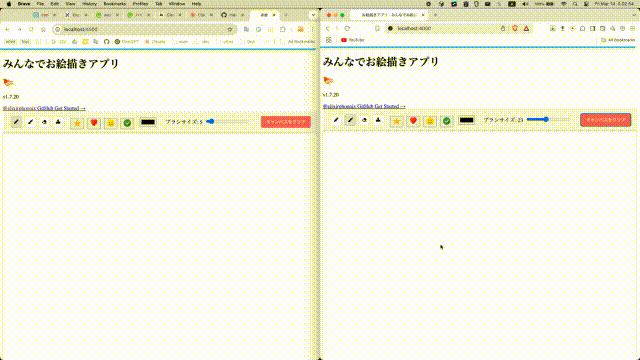

# DrawingApp

できたもの



## Requirements

- asdf
  - elixir
  - erlang

## Installation

```bash
git clone git@github.com/makoto-developer/elixir-phoenix-liveview-easy-drawing-app.git
cd elixir-phoenix-liveview-easy-drawing-app
mix deps.get
mix phx.server
```

## 設計

**システム構成**

クライアント ->  シグナリングサーバ -> Peer-to-Peer

シグナリングをPhoenix Channelsで行い、通信は可能な限りP2PでP2Pが成立しない場合はTURNサーバを使用。 

描画データの送信は、

- 最小限に圧縮して送信 (WebRTC DataChannelなど)
- カーソルの位置情報とアクションを送信 <- 今回はこっちをとった。なぜならこちらの方がデータ圧縮がないため少ないデータのためレイテンシーが低くパケット量も節約できる。

**データ管理**

描画データやチャットメッセージはGenServerで管理

グローバル状態はETSまたはMnesiaを使用

が、最初に思いついた構想。次は、TURNサーバを使った方法。

**Phoenix + WebRTC + TURN サーバ**

この構想のメリット

- Phoenixのリアルタイム性とPubSubでシグナリングを効率化
- WebRTCでP2P通信 -> サーバ負荷軽減 & レイテンシー最小化
- TURNサーバでフォールバック -> 接続の信頼性確保

**WebRTC DataChannel**

特徴

- P2P通信 -> サーバーを介さずにクライアント間で直接通信
- 低遅延 -> UDPベースの通信で、TCPよりオーバーヘッドが少ない
- セキュア -> DTLS(Datagram Transport Layer Security)による暗号化
- 全二重通信 -> 双方向にデータを同時送受信可能
- 圧縮可能 -> バイナリデータ（ArrayBuffer、Blob）や文字列の送信が可能


## ToDos

- [ ] お絵描きをもっと強化
  - [ ] スタンプボタンは仮実装なので、ブラシの大きさに合わせてスタンプを押せるようにする
  - [ ] レイヤー機能
  - [ ] 自分だけの変更を見れるようにする
  - [ ] 履歴機能(undo, redo)
  - [ ] 相手のペンがどこにあるか見えるようにする
  - [ ] ノート機能(文字を書ける)
  - [ ] ショートカットで切り替えられるようにする
  - [ ] メモリ(5pxごと？とか)の表示、非表示
- [ ] チャット機能を作る
- [ ] 他の機能を作る
  - [ ] アカウント(ゲスト、メールで登録)
  - [ ] ルーム(作成、参加、一覧、削除(作成者、もしくはグループ管理者、もしくは管理者のみ))
  - [ ] チャット機能
- [ ] さらにその先
  - [ ] 書いた線をオブジェクトとして管理して、選択して移動や削除、リサイズ、色をかえる、回転できるようにする
  - [ ] オブジェクトをグループ化して、グループ内での移動や削除、リサイズ、回転できるようにする
  - [ ] 2Core/4GRAMで、10_000TPSくらい捌けるようにチューニング...Elixirなら余裕!
  - [ ] 可用性設計
    - [ ] TURNサーバ（coturn）のセットアップ <- NAT越えに絶対必要。
    - [ ] Elixirクラスター作成
      - [ ] Gigalixir, Heroku, AWS, GCP, Cloudflare Workers, Vercel, さくらVPS, どれかもしくは複数で設定方法を書く
      - [ ] miroで設計図を公開(もしくは自分のポートフォリオサーバで公開もしくはNotion)
      - [ ] Network図
  - [ ] セキュリティ設計